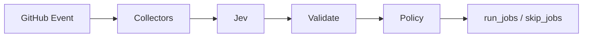

# JEV CI Pathfinder

[](https://github.com/JevForge/jev-ci-pathfinder/releases)
[](LICENSE)
[](https://github.com/JevForge/jev-ci-pathfinder/actions/workflows/ci.yml)
[](https://nodejs.org/)

**Select which allowlisted CI jobs should run after a change** — and which ones can safely be skipped — using [TypeSafe Jev](https://vercel.com/ai-gateway/models/jev) as a typed decision layer inside GitHub Actions.

Running every job on every push wastes minutes and money. Letting an unconstrained model invent skip lists is unsafe. Pathfinder keeps the job list in your config, asks Jev which allowlisted jobs the change needs, then applies deterministic rules a model cannot bypass. Downstream jobs read `run_jobs` / `skip_jobs` with `if:`. The Action never edits workflow files.

```yaml
- id: plan
  uses: JevForge/jev-ci-pathfinder@v0
  env:
    AI_GATEWAY_API_KEY: ${{ secrets.AI_GATEWAY_API_KEY }}
```

## Features

* Typed CI path selection powered by Jev (`experimental_evaluate`, not free-form generation)
* Secret-based authentication (`AI_GATEWAY_API_KEY`, `TYPESAFE_API_KEY`, or `JEV_CUSTOM_API_KEY`)
* Structured outputs for later jobs (`run_jobs`, `skip_jobs`, `decision`, `confidence`, …)
* Deterministic allowlist, path hits, always-on jobs, and dependency closure
* Optional history reruns and monorepo / CI inventory evidence
* Safe failure policies: `fail` | `warn` | `request-review` | `no-op`
* Never rewrites workflows; `dry_run` is accepted for compatibility only

## How it works

```text
GitHub event / changed paths
        ↓
Collect config, diff, optional history & monorepo plan
        ↓
Normalize + redact
        ↓
Jev evaluates each allowlisted job (typed booleans)
        ↓
Schema validation + confidence policy
        ↓
run_jobs / skip_jobs outputs
        ↓
Downstream jobs use if: contains(fromJSON(...), 'unit')
```



1. Load the job allowlist from `.jev/ci-pathfinder.yml` (or `job_map`).
2. Collect changed paths from the event or `changed_paths`.
3. Optionally gather history, monorepo, and CI inventory as evidence.
4. Call Jev through `jev_provider` (no silent provider fallback).
5. Validate the response; drop unknown job ids; close `needs` edges.
6. Emit outputs. Free-form `summary` text is display-only and must never be executed.

## Demo

```text
Pull Request touches src/api/handler.ts
        ↓
Allowlist: lint (always), unit, integration, docs
        ↓
Jev → run unit + integration (path/evidence)
Policy → keep lint (always) + close needs
        ↓
run_jobs  = ["lint","unit","integration"]
skip_jobs = ["docs"]
        ↓
Only lint / unit / integration jobs execute
```

## Why JEV?

Jev is the decision engine, not a chat model in this Action. Pathfinder asks one boolean question per allowlisted job (plus abstain / request-review). That returns a typed selection instead of prose you would have to parse or trust as shell.

The deterministic executor still owns the effect: allowlist, path hits, always-on jobs, dependency closure, and the low-confidence policy. If Jev is down or the schema rejects the answer, Pathfinder does not invent a “smart” skip list — it follows `low_confidence_policy` and marks `provisional=true`.

## Quick Start

1. Copy [`examples/ci-pathfinder.yml`](examples/ci-pathfinder.yml) to `.jev/ci-pathfinder.yml` in your consumer repo. Protect it with CODEOWNERS.
2. Add repository secret `AI_GATEWAY_API_KEY` (default provider).
3. Add a workflow (see [examples/workflows/selective-ci.yml](examples/workflows/selective-ci.yml)):

```yaml
name: Selective CI
on:
  pull_request:

permissions:
  contents: read
  pull-requests: read

jobs:
  pathfinder:
    runs-on: ubuntu-latest
    outputs:
      run_jobs: ${{ steps.plan.outputs.run_jobs }}
    steps:
      - uses: actions/checkout@v4
      - id: plan
        uses: JevForge/jev-ci-pathfinder@v0
        env:
          AI_GATEWAY_API_KEY: ${{ secrets.AI_GATEWAY_API_KEY }}

  unit:
    needs: pathfinder
    if: contains(fromJSON(needs.pathfinder.outputs.run_jobs), 'unit')
    runs-on: ubuntu-latest
    steps:
      - uses: actions/checkout@v4
      - run: npm test
```

Pin `@v0` for the floating major, `@v0.1.2` for a fixed release, or a commit SHA for the strongest supply-chain guarantee.

## Complete Example

```yaml
name: Selective CI
on:
  pull_request:
  push:
    branches: [main]

permissions:
  contents: read
  pull-requests: read
  # actions: read   # only if include_history: true

jobs:
  pathfinder:
    runs-on: ubuntu-latest
    outputs:
      run_jobs: ${{ steps.plan.outputs.run_jobs }}
      decision: ${{ steps.plan.outputs.decision }}
      provisional: ${{ steps.plan.outputs.provisional }}
    steps:
      - uses: actions/checkout@v4

      - id: plan
        uses: JevForge/jev-ci-pathfinder@v0
        env:
          AI_GATEWAY_API_KEY: ${{ secrets.AI_GATEWAY_API_KEY }}
        with:
          config_path: .jev/ci-pathfinder.yml
          min_confidence: '0.7'
          low_confidence_policy: warn
          require_path_hits: 'true'

      - name: Show plan
        run: |
          echo "decision=${{ steps.plan.outputs.decision }}"
          echo "run_jobs=${{ steps.plan.outputs.run_jobs }}"
          echo "skip_jobs=${{ steps.plan.outputs.skip_jobs }}"
          echo "provisional=${{ steps.plan.outputs.provisional }}"

  lint:
    needs: pathfinder
    if: contains(fromJSON(needs.pathfinder.outputs.run_jobs), 'lint')
    runs-on: ubuntu-latest
    steps:
      - uses: actions/checkout@v4
      - run: npm run lint

  unit:
    needs: pathfinder
    if: contains(fromJSON(needs.pathfinder.outputs.run_jobs), 'unit')
    runs-on: ubuntu-latest
    steps:
      - uses: actions/checkout@v4
      - run: npm test

  integration:
    needs: pathfinder
    if: contains(fromJSON(needs.pathfinder.outputs.run_jobs), 'integration')
    runs-on: ubuntu-latest
    steps:
      - uses: actions/checkout@v4
      - run: npm run test:integration
```

Prefer `fromJSON(run_jobs)` over CSV. `contains` on a comma-separated string can match a prefix of another job id.

## Inputs

| Input | Required | Default | Description |
| ----- | -------- | ------- | ----------- |
| `config_path` | no | `.jev/ci-pathfinder.yml` | Job allowlist, path globs, `needs`, always-on flags, optional package map |
| `changed_paths` | no | _(event diff)_ | Newline list or JSON array of repo-relative paths |
| `job_map` | no | _(empty)_ | JSON array that replaces jobs from the config file |
| `jev_provider` | no | `vercel-ai-gateway` | `vercel-ai-gateway`, `typesafe-native`, or `custom-compatible` |
| `jev_model` | no | `typesafe-ai/jev` on the gateway | Catalog model id for native/custom providers |
| `jev_endpoint` | for native/custom | _(none)_ | HTTPS evaluate endpoint (prefer Action input over repo config) |
| `jev_timeout_ms` | no | `45000` | Provider timeout (1000–120000) |
| `jev_config_path` | no | `.jev/config.yml` | Shared defaults (`jev_provider`, `min_confidence`, policy) |
| `min_confidence` | no | `0.7` | Below this, a selection cannot skip jobs |
| `low_confidence_policy` | no | `warn` | `fail`, `warn`, `request-review`, or `no-op` |
| `include_history` | no | `false` | Read history file and, with a token, Actions run metadata |
| `history_path` | no | `.jev/ci-history.json` | Local history evidence |
| `history_lookback` | no | config or `10` | 1–20 runs |
| `history_branch` | no | _(empty)_ | Filter history to one branch |
| `monorepo_plan` | no | _(empty)_ | JSON from JEV Monorepo Navigator |
| `monorepo_authoritative` | no | `false` | Union mapped allowlisted jobs into the run set |
| `discover_monorepo` | no | `true` | Discover pnpm / npm workspaces / nx projects |
| `discover_workflows` | no | `true` | Read CI inventory (job ids only; never step scripts) |
| `workflows_dir` | no | `.github/workflows` | GitHub Actions workflow directory |
| `ci_tools` | no | `github-actions` | `github-actions`, `circleci`, `jenkins` |
| `require_path_hits` | no | `true` | Path-matched jobs cannot be skipped by Jev |
| `trust_repo_jev_endpoint` | no | `false` | Allow repo-configured endpoint to receive credentials |
| `token` | no | `${{ github.token }}` | Read PR files and optional Actions history |
| `dry_run` | no | `true` | Compatibility only; the Action never edits workflows |

## Outputs

| Output | Description |
| ------ | ----------- |
| `decision` | `SELECT_JOBS`, `ABSTAIN`, or `REQUEST_REVIEW` |
| `run_jobs` | JSON array of allowlisted job ids to run (config order) |
| `skip_jobs` | JSON array of allowlisted job ids to skip (config order) |
| `run_jobs_csv` | Comma-separated run ids (prefer JSON) |
| `skip_jobs_csv` | Comma-separated skip ids (prefer JSON) |
| `confidence` | Jev confidence from 0 to 1 (policy does not invent a higher value) |
| `reason_codes` | JSON array of stable reason codes |
| `summary` | Plain-text explanation — never execute it |
| `provisional` | `true` when the run set came from policy, not a trusted Jev selection |
| `needs_review` | `true` when the request-review policy applied |
| `affected_paths` | JSON array of normalized changed paths |
| `history_applied` | JSON array of jobs forced by recent failures |
| `monorepo_projects` | JSON array of affected project names |
| `jev_provider` | Provider that was called (never silently swapped) |

`run_jobs` and `skip_jobs` always partition the configured allowlist.

### Using outputs in conditions

```yaml
unit:
  needs: pathfinder
  if: contains(fromJSON(needs.pathfinder.outputs.run_jobs), 'unit')
  runs-on: ubuntu-latest
  steps:
    - uses: actions/checkout@v4
    - run: npm test
```

Gate a deploy-style job on a trusted selection:

```yaml
if: needs.pathfinder.outputs.decision == 'SELECT_JOBS' && needs.pathfinder.outputs.provisional == 'false'
```

The pathfinder job must succeed for dependents to see outputs. Default `warn` succeeds and runs the full allowlist when Jev is not trusted. `fail` still writes the full allowlist, then fails the step.

## Authentication

Credentials are **environment variables**, not Action inputs:

| Provider (`jev_provider`) | Secret name |
| ------------------------- | ----------- |
| `vercel-ai-gateway` (default) | `AI_GATEWAY_API_KEY` |
| `typesafe-native` | `TYPESAFE_API_KEY` |
| `custom-compatible` | `JEV_CUSTOM_API_KEY` |

```text
Repository → Settings → Secrets and variables → Actions → New repository secret
```

```yaml
env:
  AI_GATEWAY_API_KEY: ${{ secrets.AI_GATEWAY_API_KEY }}
```

There is no silent fallback between providers. `vercel-ai-gateway` uses the AI SDK `experimental_evaluate` API with model `typesafe-ai/jev` (not `generateText`). Native and custom providers require `jev_endpoint` and `jev_model`. An endpoint from repository config does not receive credentials unless `trust_repo_jev_endpoint` is true.

## Permissions

```yaml
permissions:
  contents: read
  pull-requests: read
```

Add `actions: read` only when `include_history: true` and you want GitHub Actions run metadata. No write permission is required.

## Advanced usage

### Explicit changed paths (reusable / workflow_dispatch)

```yaml
with:
  changed_paths: |
    src/app.ts
    docs/guide.md
```

### History-aware reruns

Jobs with `rerun_on_recent_failure: true` can be forced back into `run_jobs` when recent history shows a failure:

```yaml
with:
  include_history: 'true'
# permissions: actions: read
```

### Monorepo Navigator hand-off

```yaml
with:
  monorepo_plan: ${{ needs.mono.outputs.plan }}
  monorepo_authoritative: 'true'
```

Only allowlisted job ids from the plan are kept; unknown ids are dropped (`MONOREPO_JOB_DROPPED`).

### Push events

On `push`, Pathfinder reads commit path lists from the payload and, when truncated, may call the compare API with `token`.

## Decision model and policies

| Policy | Run set when Jev is untrusted | Exit | `decision` |
| ------ | ----------------------------- | ---- | ---------- |
| `warn` (default) | full allowlist | success + warning | `ABSTAIN` or `REQUEST_REVIEW` |
| `fail` | full allowlist | failure after outputs | same |
| `request-review` | full allowlist | success, `needs_review=true` | `REQUEST_REVIEW` |
| `no-op` | always-on (+ history / authoritative monorepo) | success | `ABSTAIN` or `REQUEST_REVIEW` |

These sets are deterministic. They are not reported as a Jev selection (`provisional=true`).

**Reason codes:** `PATH_MATCH`, `NO_PATH_MATCH`, `DEPENDENCY_CLOSURE`, `ALWAYS_RUN`, `HISTORY_RERUN`, `HISTORY_UNAVAILABLE`, `MONOREPO_AFFECTED`, `MONOREPO_JOB_DROPPED`, `CI_INVENTORY_MATCH`, `CI_JOB_NOT_IN_WORKFLOW`, `LOW_CONFIDENCE`, `JEV_UNAVAILABLE`, `SCHEMA_REJECTED`, `POLICY_ABSTAIN`, `POLICY_REQUEST_REVIEW`, `POLICY_RUN_ALL`, `POLICY_NO_OP`, `NO_CHANGED_PATHS`, `CONFIGURED_ALLOWLIST`.

See [docs/decision-contract.md](docs/decision-contract.md) for accepted vs rejected decision payloads.

## Data sent to Jev

Sent:

* up to 200 normalized changed paths
* allowlisted job ids, path globs, `needs`, always-on flags, path-hit flags
* history failure counts (not logs)
* affected project names and mapped allowlisted jobs
* CI inventory file names and job ids

Not sent: file contents, step scripts, secrets, or tokens. A fixed note marks paths and names as untrusted. The Vercel gateway call sets `zeroDataRetention`.

## Security

* Jev text is never interpolated into a shell, workflow file, or GitHub API call.
* Job ids must match `^[A-Za-z][A-Za-z0-9_-]{0,63}$`.
* Paths must be repo-relative (no `..`).
* Custom endpoints must be public HTTPS (no loopback / link-local / private IPs).
* Secrets are redacted from error strings.

See [SECURITY.md](SECURITY.md). Report vulnerabilities privately — never open a public issue with tokens or a working exploit.

## Troubleshooting

| Symptom | What to check |
| ------- | ------------- |
| `provisional=true` and full allowlist | Missing secret, provider outage, schema rejection, or confidence below `min_confidence` |
| `HISTORY_UNAVAILABLE` | Enable `include_history`, provide `actions: read`, or a valid `history_path` file |
| Endpoint refused | Use Action input for `jev_endpoint`, or set `trust_repo_jev_endpoint: true` on a protected config |
| Dependents skipped entirely | Pathfinder job failed (`fail` policy) — dependents need a successful pathfinder job to see outputs |

## Versioning

| Pin | Meaning |
| --- | ------- |
| `@v0` | Floating major (moves with new `0.x` releases) |
| `@v0.1.2` | Exact SemVer release |
| `@<sha>` | Strongest supply-chain pin |

Marketplace listing notes: [docs/marketplace.md](docs/marketplace.md).

## Development

```bash
npm ci
npm run all
```

Requires Node.js 24+. `npm run all` typechecks, runs coverage, and rebuilds the committed `dist/index.js` bundle (consumers do not run `npm install` for this Action).

`@jevforge/core` is not published yet; `src/jev` holds the local provider contract.

## Contributing

See [CONTRIBUTING.md](CONTRIBUTING.md). Use the [bug](.github/ISSUE_TEMPLATE/bug_report.yml) and [feature](.github/ISSUE_TEMPLATE/feature_request.yml) templates. **Do not include API keys or tokens.**

## License

[MIT](LICENSE)
