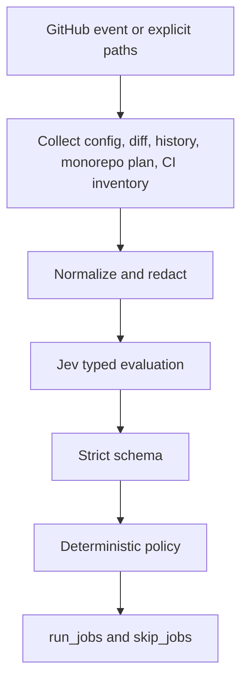

# JEV CI Pathfinder

JEV CI Pathfinder decides which configured CI jobs should run after a change. Jev returns a typed selection. A deterministic executor turns that selection into `run_jobs` and `skip_jobs` that a workflow can read from `if:`. The action never edits workflow files.

## Problem

Running every job on every change wastes CI time. Skipping jobs from an unvalidated model response can hide failures. Pathfinder keeps the job list in configuration, asks Jev which allowlisted jobs the change needs, and then applies rules that a model cannot bypass: the allowlist, always-on jobs, dependency closure, path hits, and the low-confidence policy.

## How it works



Jev answers one boolean question per allowlisted job, plus abstain and request-review questions. It does not return shell, workflow YAML, or new job ids. The executor:

- drops any id outside the configured allowlist
- adds `always: true` jobs
- adds jobs whose paths match the diff when `require_path_hits` is true
- adds configured history reruns and, when requested, authoritative monorepo jobs
- adds `needs` dependencies until the graph is closed
- sets `skip_jobs` to the complement of `run_jobs`
- replaces an untrusted result with the configured policy instead of inventing a Jev decision

If Jev is unavailable, the schema rejects the response, or confidence is below `min_confidence`, the output `decision` stays `ABSTAIN` or `REQUEST_REVIEW` and `provisional` is `true`.

## Quick start

```yaml
name: Selective CI
on:
  pull_request:
permissions:
  contents: read
  pull-requests: read

jobs:
  pathfinder:
    runs-on: ubuntu-latest
    outputs:
      run_jobs: ${{ steps.plan.outputs.run_jobs }}
    steps:
      - uses: actions/checkout@v4
      - id: plan
        uses: JevForge/jev-ci-pathfinder@v0.1.0
        env:
          AI_GATEWAY_API_KEY: ${{ secrets.AI_GATEWAY_API_KEY }}

  unit:
    needs: pathfinder
    if: contains(fromJSON(needs.pathfinder.outputs.run_jobs), 'unit')
    runs-on: ubuntu-latest
    steps:
      - uses: actions/checkout@v4
      - run: npm test
```

Pin to a commit SHA when you want the strongest supply-chain guarantee. A major tag is more convenient and moves when a new major release is published. This repository does not publish a GitHub Marketplace listing until that release is explicitly requested.

Create `.jev/ci-pathfinder.yml` from [examples/ci-pathfinder.yml](examples/ci-pathfinder.yml). Protect that file with code owners. A pull request can change which jobs exist; it must not be able to redirect Jev credentials.

## Inputs

| Input | Required | Default | Role |
| --- | --- | --- | --- |
| `config_path` | no | `.jev/ci-pathfinder.yml` | Allowlist, path globs, `needs`, always-on jobs, package map |
| `changed_paths` | no | event diff | Newline list or JSON array of repo-relative paths |
| `job_map` | no | empty | JSON array that replaces jobs from the config file |
| `jev_provider` | no | `vercel-ai-gateway` | `vercel-ai-gateway`, `typesafe-native`, or `custom-compatible` |
| `jev_model` | no | `typesafe-ai/jev` on the gateway | Catalog model for native and custom providers |
| `jev_endpoint` | native/custom | none | HTTPS endpoint. Required as an action input unless `trust_repo_jev_endpoint` is true |
| `jev_timeout_ms` | no | `45000` | 1000–120000 |
| `min_confidence` | no | `0.7` | Below this, a selection cannot skip jobs |
| `low_confidence_policy` | no | `warn` | `fail`, `warn`, `request-review`, or `no-op` |
| `include_history` | no | `false` | Read history file and Actions run metadata |
| `history_path` | no | `.jev/ci-history.json` | Local history evidence |
| `history_lookback` | no | config or `10` | 1–20 runs |
| `history_branch` | no | empty | Filter history to one branch |
| `monorepo_plan` | no | empty | JSON from JEV Monorepo Navigator |
| `monorepo_authoritative` | no | `false` | Union mapped allowlisted jobs into the run set |
| `discover_monorepo` | no | `true` | Read pnpm, npm workspaces, or nx projects |
| `discover_workflows` | no | `true` | Read CI inventory. Do not send step scripts to Jev |
| `ci_tools` | no | `github-actions` | `github-actions`, `circleci`, `jenkins` |
| `require_path_hits` | no | `true` | A path-matched job cannot be skipped by Jev |
| `trust_repo_jev_endpoint` | no | `false` | Allow a repo-configured endpoint to receive credentials |
| `token` | no | `github.token` | Read pull request files and Actions history |
| `dry_run` | no | `true` | No effect on writes. The action never edits workflows |

Provider credentials come from environment variables, not inputs:

- `vercel-ai-gateway`: `AI_GATEWAY_API_KEY`
- `typesafe-native`: `TYPESAFE_API_KEY`
- `custom-compatible`: `JEV_CUSTOM_API_KEY`

There is no silent fallback between providers. `vercel-ai-gateway` calls the AI SDK `experimental_evaluate` API with model `typesafe-ai/jev`. It does not call `generateText`. The official TypeSafe native base URL is not published by `@jevforge/core` yet, so `typesafe-native` requires `jev_endpoint` and `jev_model`.

Shared defaults can also live in `.jev/config.yml`: `jev_provider`, `min_confidence`, and `low_confidence_policy`. A model override for the gateway is taken from the action input only, so a pull request cannot retarget the gateway model. An endpoint in that file is ignored unless `trust_repo_jev_endpoint` is true.

## Outputs

| Output | Format |
| --- | --- |
| `decision` | `SELECT_JOBS`, `ABSTAIN`, or `REQUEST_REVIEW` |
| `run_jobs` | JSON array, config order |
| `skip_jobs` | JSON array, config order |
| `run_jobs_csv` / `skip_jobs_csv` | Comma-separated ids. Prefer JSON, because `contains` can match a prefix of another id |
| `confidence` | Number from 0 to 1 |
| `reason_codes` | JSON array of the codes below |
| `summary` | Single-line explanation. Never execute it |
| `provisional` | `true` when policy, not a trusted Jev selection, produced the run set |
| `needs_review` | `true` when the request-review policy applied |
| `affected_paths` | JSON array of normalized paths |
| `history_applied` | JSON array of jobs forced by recent failures |
| `monorepo_projects` | JSON array of affected project names |
| `jev_provider` | Provider that was called |

`run_jobs` and `skip_jobs` always partition the allowlist. Downstream jobs should use:

```yaml
if: contains(fromJSON(needs.pathfinder.outputs.run_jobs), 'unit')
```

The pathfinder job must succeed for dependent jobs to see outputs. The default `warn` policy succeeds and runs the full allowlist when Jev is not trusted. `fail` still writes the full allowlist, then fails the step. Dependents do not run unless the workflow uses `if: always()` and checks the outputs itself.

## Decision model

Jev participates by marking each allowlisted job true or false and by raising abstain or request-review. Confidence is the average decisiveness of those answers, or the provider confidence map when TypeSafe returns one. Abstain probability at or above 0.55 clears the selection. Request-review probability at or above 0.55 does the same when confidence is below 0.85.

The executor then limits the effect:

- unknown job ids invalidate the selection
- path hits stay when `require_path_hits` is true
- `always` jobs stay
- `needs` edges are closed, including cycles rejected at config load
- history can add a job only when that job sets `rerun_on_recent_failure` and a recent run failed it
- monorepo discovery and navigator plans are evidence unless `monorepo_authoritative` is true
- CI inventory never adds a job that is not already allowlisted, and step scripts are not read

### Low confidence and outages

| Policy | Run set | Exit | `decision` |
| --- | --- | --- | --- |
| `warn` | full allowlist | success, with a warning | `ABSTAIN` or the model's `REQUEST_REVIEW` |
| `fail` | full allowlist | failure after outputs are written | same |
| `request-review` | full allowlist | success, `needs_review=true` | `REQUEST_REVIEW` |
| `no-op` | always-on jobs, plus history reruns and authoritative monorepo jobs | success | `ABSTAIN` or `REQUEST_REVIEW` |

These sets are deterministic. They are not reported as a Jev selection.

### Reason codes

`PATH_MATCH`, `NO_PATH_MATCH`, `DEPENDENCY_CLOSURE`, `ALWAYS_RUN`, `HISTORY_RERUN`, `HISTORY_UNAVAILABLE`, `MONOREPO_AFFECTED`, `MONOREPO_JOB_DROPPED`, `CI_INVENTORY_MATCH`, `CI_JOB_NOT_IN_WORKFLOW`, `LOW_CONFIDENCE`, `JEV_UNAVAILABLE`, `SCHEMA_REJECTED`, `POLICY_ABSTAIN`, `POLICY_REQUEST_REVIEW`, `POLICY_RUN_ALL`, `POLICY_NO_OP`, `NO_CHANGED_PATHS`, `CONFIGURED_ALLOWLIST`.

### Valid selection

```json
{
  "decision": "SELECT_JOBS",
  "run_jobs": ["unit", "lint"],
  "confidence": 0.86,
  "reason_codes": ["PATH_MATCH", "ALWAYS_RUN"],
  "summary": "API sources changed; run unit and always-on lint.",
  "provisional": false,
  "provider": "vercel-ai-gateway"
}
```

### Rejected responses

The schema rejects all of these. None of them can change the workflow file or run a command:

- `decision` outside `SELECT_JOBS`, `ABSTAIN`, and `REQUEST_REVIEW`
- `confidence` below 0 or above 1
- `run_jobs` containing `unit; rm -rf /` or any id outside the job-id grammar
- duplicate `run_jobs`
- `ABSTAIN` or `REQUEST_REVIEW` with a non-empty `run_jobs`
- a reason code outside the enum
- a summary longer than 500 characters

A boolean answer that is missing or has a probability outside 0..1 is `SCHEMA_REJECTED`. The policy then runs. It does not repair the answer into a selection.

## Data sent to Jev

The evaluation state includes:

- up to 200 normalized changed paths
- allowlisted job ids, path globs, `needs`, always-on flags, and whether each path glob matched
- history counts of recent failed job ids, not logs
- affected project names and allowlisted jobs mapped from them
- CI inventory file names and job ids

It does not include file contents, step scripts, secrets, or tokens. A fixed note tells Jev that paths and names are untrusted data. The Vercel gateway call sets `zeroDataRetention`.

## Permissions

Default workflow permissions:

```yaml
permissions:
  contents: read
  pull-requests: read
```

Add `actions: read` only when `include_history` is true and you want GitHub Actions run metadata. The action does not need write permission. `dry_run: false` still does not create comments, commits, or workflow edits.

## Privacy and security

Changed paths, pull request file lists, CI config, and history are untrusted. Job ids must match `^[A-Za-z][A-Za-z0-9_-]{0,63}$`. Paths must be repo-relative and cannot contain `..`. Globs cannot use brace expansion, character classes, or negation, so a pattern cannot be reinterpreted as a shell command.

Custom and native endpoints must be HTTPS and must not be loopback, link-local, or private addresses. Credentials are not sent to an endpoint that came from repository config unless `trust_repo_jev_endpoint` is true. DNS rebinding against an allowed public hostname remains a residual risk.

See [SECURITY.md](SECURITY.md).

## Development

```bash
npm ci
npm run all
```

`npm run all` typechecks, runs coverage, and rebuilds `dist/index.js`. Consumers run the committed bundle. They do not run `npm install` for this action.

Node.js 24 is required. `@jevforge/core` is not published yet. The provider interface in `src/jev` is the local contract those adapters already share: the same typed evaluation, the same decision schema, and the same confidence policy.

## Tests

The suite covers schema acceptance and rejection, glob matching, unsafe paths, endpoint blocking, secret redaction, dependency cycles and closure, workflow and CircleCI and Jenkins inventory, monorepo discovery, history reruns, provider normalization, missing credentials, schema rejection, each low-confidence policy, and the action runtime.

## Contributing

See [CONTRIBUTING.md](CONTRIBUTING.md).

## License

[MIT](LICENSE)
